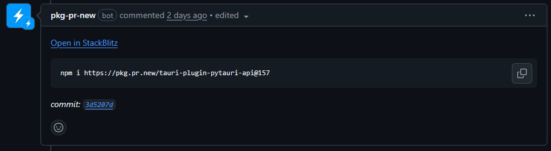

# Installing from git

If you want to use the latest PyTauri version that is not yet stable, you can install PyTauri from it's GitHub
repository.

## Rust

Append the following to your `Cargo.toml`

```toml
[patch.crates-io]
pytauri = { git = "https://github.com/pytauri/pytauri.git", branch = "main" }
pytauri-core = { git = "https://github.com/pytauri/pytauri.git", branch = "main" }
tauri-plugin-pytauri = { git = "https://github.com/pytauri/pytauri.git", branch = "main" }
```

## Python

Append the following to your `pyproject.toml`

```toml
[tool.uv.sources]
pytauri = { git = 'https://github.com/pytauri/pytauri.git', branch = "main", subdirectory = "python/pytauri" }
```

## Javascript

Run the following command.

```bash
pnpm i https://pkg.pr.new/tauri-plugin-pytauri-api@main
```

Note that if you want to pull from a specific Pull Request, there exact command to install it should usually be posted
by a bot directly below the main post as can be seen below.

